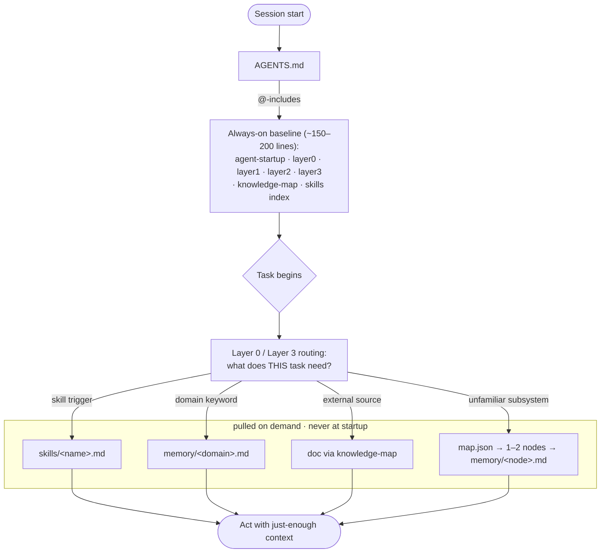

# Agent Context Architecture

[](LICENSE)
[](https://github.com/lx-wnk/Agent-Context/releases/latest)
[](https://github.com/lx-wnk/Agent-Context/actions/workflows/ci.yml)

A project-based setup and memory-handling system for Claude Code. Optimized for structuring project knowledge so that Claude always has the right context at the right time — without bloating the context window.

Instead of dumping everything into a single `CLAUDE.md`, Agent Context provides a layered architecture: all layers (0-3) are loaded at startup via `@`-includes in `AGENTS.md`, keeping the baseline at ~150-200 lines. Detailed reference (skills, memory files) is pulled in on-demand based on the task at hand. Auto-updates keep shared infrastructure current across all your projects.

## Contents

- [The Problem](#the-problem)
- [The Solution](#the-solution)
- [Architecture](#architecture)
- [Installation](#installation)
- [Documentation](#documentation)
- [Contributing](#contributing)
- [License](#license)

## The Problem

Claude Code loads project instructions into its context window every conversation. Most projects dump everything into a single `CLAUDE.md`, resulting in:

- **Context bloat:** 500-1000+ lines loaded for every task, even a one-line CSS fix
- **Duplication:** Same information in `CLAUDE.md`, `README.md`, `.claude/rules/`, and memory files
- **Noise:** Entity schemas, route tables, and file trees that Claude can discover by reading the code
- **No structure:** Flat files with no way to load context progressively based on the task

## The Solution

A layered architecture where all layers load at startup via `@`-includes in `AGENTS.md`:

```
CLAUDE.md                          (3 lines — bootstrap pointer)
AGENTS.md                          (~35 lines — identity, quick rules)
.agent-context/
  layer0-agent-workflow.md         (~35 lines — universal agent patterns)
  layer1-bootstrap.md              (~25 lines — tech stack, project identity)
  layer2-project-core.md           (~25 lines — dev principles, conventions)
  layer3-guidebook.md              (~45 lines — task → file routing table)
  memory/                          (stubs, ~10 lines each)
  skills/                          (full reference, loaded on-demand)
```

**Baseline:** ~150-200 lines (AGENTS.md + all layers). Full reference (skills, memory): loaded only when trigger keywords match.

Auto-updates are built in: the agent fetches the setup prompt from remote, which auto-detects UPDATE mode, checks for new releases via the GitHub Releases API, and updates shared files. Project-owned files are never overwritten.

## Architecture

The core idea in one picture — a small baseline loads at startup, and everything heavy is pulled only when a task actually needs it:



The file-ownership view — what the framework ships vs. what your project owns:

```
agent-context Repo (source)              Project / User (target)
─────────────────────────────            ──────────────────────────
context/agent-startup.md          →──    .agent-context/agent-startup.md (overwritable)
context/layer0-agent-workflow.md  →──    .agent-context/layer0-agent-workflow.md (overwritable)
context/base-principles.md        →──    .agent-context/base-principles.md (overwritable)
templates/*                       →──    AGENTS.md, layer1-3, memory/ (project-owned)
```

**Overwritable** files are updated on every release. **Project-owned** files are created once and never overwritten. The installed version is tracked in `.agent-context/.agent-context-version` — written by the agent from the release tag.

### Layer System

| Layer   | Location                                  | Content                           | Ownership        |
| ------- | ----------------------------------------- | --------------------------------- | ---------------- |
| Startup | `.agent-context/agent-startup.md`         | Version check, update info        | Shared (updated) |
| 0       | `.agent-context/layer0-agent-workflow.md` | Universal agent workflow          | Shared (updated) |
| Base    | `.agent-context/base-principles.md`       | Dev principles                    | Shared (updated) |
| 1       | `.agent-context/layer1-bootstrap.md`      | Project identity, Docker, domains | Project          |
| 2       | `.agent-context/layer2-project-core.md`   | Dev rules + `@` ref to base       | Project          |
| 3       | `.agent-context/layer3-guidebook.md`      | Task routing, skills, memory      | Project          |

See [Architecture](docs/architecture.md) for the full mental model, layer loading, and runtime read flow.

## Installation

### Quick Start

Run this one-liner from your project root:

```bash
/bin/bash -c "$(curl -fsSL https://raw.githubusercontent.com/lx-wnk/Agent-Context/main/install.sh)"
```

**Requires:** [Claude Code CLI](https://claude.ai/code) installed and authenticated.

See [what gets created](docs/architecture.md#what-gets-created) and [alternative install](docs/architecture.md#alternative-paste-into-a-session).

## Documentation

- [Architecture](docs/architecture.md) — layer system, repo-to-project mapping, how it works, runtime read flow, repository structure
- [Discovery Map](docs/discovery-map.md) — on-demand codebase discovery for large/unfamiliar projects
- [Enforcement & Hygiene](docs/enforcement.md) — deterministic hooks, token budget, memory decay, portable skills, updates
- [Key Principles](docs/principles.md) — the five design principles behind this architecture
- [Research & References](docs/references.md) — papers and articles the design is based on
- [Skill Standard](docs/skill-standard.md) — the open Agent Skills standard used by `.agent-context/skills/`
- [Contributing](CONTRIBUTING.md) — dev setup, smoke tests, and the PR process

## Contributing

Contributions are welcome. Run `npm test` and `npm run prettier` before opening a PR — see [CONTRIBUTING.md](CONTRIBUTING.md) for the full dev setup, smoke tests, and the PR template.

## License

MIT
