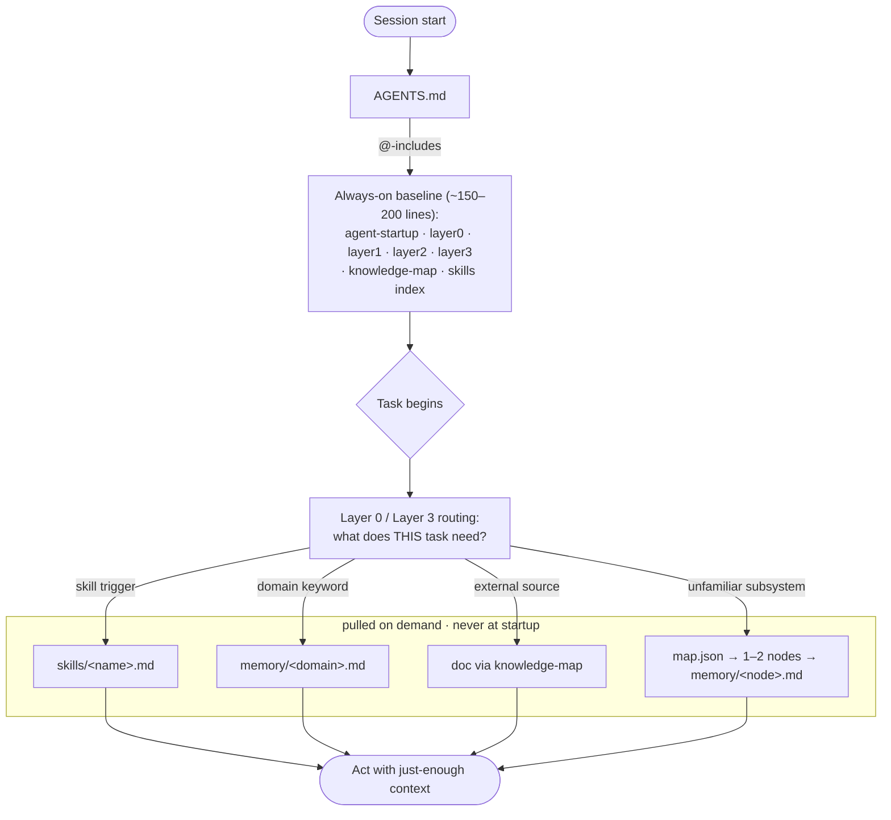

# Agent Context Architecture

[](LICENSE)
[](https://github.com/lx-wnk/Agent-Context/releases/latest)
[](https://github.com/lx-wnk/Agent-Context/actions/workflows/ci.yml)

A project-based setup and memory-handling system for AI coding agents, with first-class Claude Code support. Its entry point is the agent-agnostic `AGENTS.md`. Optimized for structuring project knowledge so that your agent always has the right context at the right time — without bloating the context window.

Instead of dumping everything into a single `CLAUDE.md`, Agent Context provides a layered architecture: all layers (0-3) are loaded at startup via `@`-includes in `AGENTS.md`, keeping the baseline at ~150-200 lines. Detailed reference (skills, memory files) is pulled in on-demand based on the task at hand. Re-running the installer updates the shared infrastructure to the latest release without touching project-owned files.

## Contents

- [The Problem](#the-problem)
- [The Solution](#the-solution)
- [Scope](#scope)
- [Installation](#installation)
- [Architecture](#architecture)
- [Documentation](#documentation)
- [Contributing](#contributing)
- [License](#license)

## The Problem

Claude Code loads project instructions into its context window every conversation. Most projects dump everything into a single `CLAUDE.md`, resulting in:

- **Context bloat:** every line of the file is loaded for every task, even a one-line CSS fix
- **Duplication:** Same information in `CLAUDE.md`, `README.md`, `.claude/rules/`, and memory files
- **Noise:** Entity schemas, route tables, and file trees that Claude can discover by reading the code
- **No structure:** Flat files with no way to load context progressively based on the task

## The Solution

A layered architecture where all layers load at startup via `@`-includes in `AGENTS.md`:

```
AGENTS.md                          (~35 lines — identity, quick rules)
.claude/
  CLAUDE.md                        (3 lines — bootstrap pointer to ../AGENTS.md)
  commands/                        (/discover, /memory-review, /decision-review)
.agent-context/
  agent-startup.md                 (~15 lines — update instructions)
  layer0-agent-workflow.md         (~70 lines — universal agent patterns)
  base-principles.md               (~30 lines — non-obvious dev principles)
  layer1-bootstrap.md              (~35 lines — tech stack, project identity)
  layer2-project-core.md           (~20 lines — dev principles, conventions)
  layer3-guidebook.md              (~45 lines — task → file routing table)
  knowledge-map.md                 (index of external doc sources)
  hooks.conf, budget.conf          (project-owned config: hook toggles, budget caps)
  bin/                             (budget gates, baseline measurement, memory prune)
  hooks/                           (optional deterministic hooks, off by default)
  memory/                          (stubs, 3-25 lines each)
  skills/                          (full reference, loaded on-demand)
```

Line counts are for the shipped files and templates before discovery fills them in.

**Baseline:** AGENTS.md + all layers. Full reference (skills, memory): loaded only when trigger keywords match.

**Measured, not asserted.** `.agent-context/bin/measure-baseline.sh` counts the always-on closure against the flat equivalent — the same knowledge in a single file — and reports both. On a fresh install of the shipped templates, before discovery adds any project knowledge, 12,077 of 28,558 bytes stay out of a session until a task asks for them (42.3% by estimated token); a project's own memory and skills grow the on-demand side. Reproduce it with `bash tests/check-install-smoke.sh <dir>`, then `bash .agent-context/bin/measure-baseline.sh` inside `<dir>`. That is an upper bound, not a per-session average: a task that pulls two skills pays for those two skills, and no modelled "reads avoided" enter the number. See [Baseline Measurement](docs/enforcement.md#baseline-measurement).

Updates run on demand: re-run the install one-liner. `install.sh` resolves the latest release via the GitHub Releases API, exits early if that version is already installed, and otherwise downloads that release and replaces the shared files. The setup agent then detects UPDATE mode and re-syncs project knowledge only for documentation sources that changed since the last run (`--force` re-scans everything). Project-owned files are never overwritten.

See a fully installed project in [example.md](example.md).

## Scope

Agent Context answers one question: **what does the agent know when a session starts, and what gets pulled in afterwards.** It is deliberately not:

- **A code index.** Structure, symbols, and call graphs are discoverable from the source, and writing them into context files measurably hurts agents (see [Research & References](docs/references.md)). The `discovery-map` skill records _why_ a subsystem exists, not what is inside it.
- **A multi-agent orchestrator.** One agent, one context window. Delegation is a context-injection protocol (`agent-delegation.md`) — no roles, worktrees, or message bus.
- **A permission system.** Your agent's own permission model stays in charge during normal sessions — the installer's setup agent runs with a restricted tool allowlist, without network access (see [What the installer runs](#what-the-installer-runs)). On top of it, four optional deterministic hooks ship with the framework — a secret-write block, an auto-formatter, a test gate, and a subagent scope check. Setup registers them. The secret-write block is on by default (`PROTECT_SECRETS=0` switches it off); the other three stay off until you set `HOOKS_ENABLED=1` in the gitignored `.agent-context/hooks.local.conf`. See [Enforcement & Hygiene](docs/enforcement.md).

Tools that cover the adjacent layers are listed under [Neighbouring Systems](docs/references.md#neighbouring-systems).

## Installation

### Quick Start

Run this one-liner from your project root:

```bash
/bin/bash -c "$(curl -fsSL https://raw.githubusercontent.com/lx-wnk/Agent-Context/main/install.sh)"
```

**Requires:** [Claude Code CLI](https://claude.ai/code) installed and authenticated, and bash (the installer refuses other shells).

#### What the installer runs

The work is split: `install.sh` does every mechanical step itself, and an agent only handles knowledge.

1. `install.sh` resolves the latest release and downloads its source archive (or uses your clone with `--local-source`). If the lookup or download fails, it stops before any agent starts.
2. It installs the shared files into `.agent-context/` and `.claude/commands/`. A same-named command of yours is kept.
3. It starts `claude -p` headless on that release's setup prompt, restricted: `--permission-mode acceptEdits`, `--strict-mcp-config` (none of your MCP servers), WebFetch and WebSearch denied, and `--allowedTools` limited to Read, Write, Edit, Glob, Grep, Agent and non-network shell commands (file commands, read-only `git` plus `git rm`, checksum and text tools, and the two shipped scripts it runs). The agent has no network access; any other command is denied rather than prompted. It reads your repository's docs to fill the context layers and can edit files in the project — install into repositories whose content you trust.
4. After the agent finishes, `install.sh` registers the four hooks in `.claude/settings.json` (creating it, or adding only the entries it lacks), points `.claude/CLAUDE.md` at `AGENTS.md`, and checks that every shared file matches the release. Only then does it write `.agent-context/.agent-context-version`. Anything missing is listed, and the run exits with code 2.

#### Flags

The one-liner runs through `bash -c`, whose first argument becomes `$0`. Put `_` before any flag so it reaches the installer:

```bash
/bin/bash -c "$(curl -fsSL https://raw.githubusercontent.com/lx-wnk/Agent-Context/main/install.sh)" _ --force
```

| Flag                                             | Effect                                                                                                                                                                            |
| ------------------------------------------------ | --------------------------------------------------------------------------------------------------------------------------------------------------------------------------------- |
| `--force`                                        | Full from-scratch rediscovery: re-scans the whole codebase at setup depth even on an existing install and merges into existing knowledge without deleting still-valid facts.      |
| `--discover`                                     | After the run, checks for a [discovery map](docs/discovery-map.md) and, if none exists, points you to the interactive `/discover` command (the headless run never builds one).    |
| `--local-source <path>`, `--local-source=<path>` | Installs from a local clone instead of GitHub; for developing Agent Context itself. Runs a normal update — add `--force` for a full rediscovery. Env var: `AGENT_CONTEXT_SOURCE`. |
| `--ai-dirs=<dirs>`                               | Comma-separated extra AI-doc directories to treat as migratable (e.g. `--ai-dirs=".cursor,.ai-custom"`).                                                                          |

See [what gets created](docs/architecture.md#what-gets-created) and [alternative install](docs/architecture.md#alternative-paste-into-a-session).

## Architecture

The core idea in one picture — a small baseline loads at startup, and everything heavy is pulled only when a task actually needs it:


```mermaid
flowchart TD
    Start([Session start]) --> AG[AGENTS.md]
    AG -->|"@-includes"| Base["Always-on baseline (~150–200 lines):<br/>agent-startup · layer0 · layer1 · layer2 · layer3<br/>· knowledge-map · skills index"]
    Base --> Task{Task begins}
    Task --> Route["Layer 0 / Layer 3 routing:<br/>what does THIS task need?"]

    Route -->|skill trigger| Skill["skills/&lt;name&gt;.md"]
    Route -->|domain keyword| Mem["memory/&lt;domain&gt;.md"]
    Route -->|external source| Doc["doc via knowledge-map"]
    Route -->|unfamiliar subsystem| Map["map.json → 1–2 nodes → memory/&lt;node&gt;.md"]

    Skill --> Act([Act with just-enough context])
    Mem --> Act
    Doc --> Act
    Map --> Act

    subgraph OnDemand ["pulled on demand · never at startup"]
        Skill
        Mem
        Doc
        Map
    end
```

The file-ownership view — what the framework ships vs. what your project owns:

```
agent-context Repo (source)              Project / User (target)
─────────────────────────────            ──────────────────────────
context/*.md                      →──    .agent-context/*.md (overwritable)
context/bin/, context/hooks/      →──    .agent-context/bin/, .agent-context/hooks/ (overwritable)
context/skills/                   →──    .agent-context/skills/ (overwritable)
context/commands/                 →──    .claude/commands/ (overwritable)
.prompts/*-review-prompt.md       →──    .agent-context/*-review-prompt.md (overwritable)
templates/*                       →──    AGENTS.md, .claude/, layer1-3, memory/, *.conf (project-owned)
```

**Overwritable** files are replaced on every update. **Project-owned** files are created once and never overwritten. The installed version is tracked in `.agent-context/.agent-context-version` — written by the agent from the release tag.

See [Architecture](docs/architecture.md) for the full mental model, layer loading, and runtime read flow.

## Documentation

- [Example](example.md)
- [Architecture](docs/architecture.md)
- [Discovery Map](docs/discovery-map.md)
- [Enforcement & Hygiene](docs/enforcement.md)
- [Key Principles](docs/principles.md)
- [Research & References](docs/references.md)
- [Skill Standard](docs/skill-standard.md)
- [Contributing](CONTRIBUTING.md)

See [docs/](docs/README.md) for the full documentation index.

## Contributing

Contributions are welcome. Run `npm test` and `npm run prettier` before opening a PR — see [CONTRIBUTING.md](CONTRIBUTING.md) for the full dev setup, smoke tests, and the PR template.

## License

MIT
